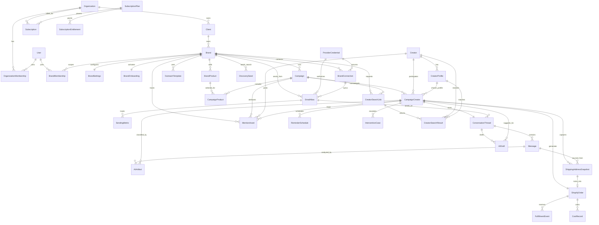

# Phase 8b Canonical Schema

Last updated: 2026-03-06
Owner: Phase 8 execution
Depends on: `docs/planning/phase-8/a/architecture.md`

## 1. Schema Design Rules

### Fixed Behavior, Flexible Implementation
The schema preserves lifecycle behavior, not legacy Airtable/n8n table shapes.

Locked behavioral constraints from the handoff:
- approval is a human gate
- outreach is email-first
- follow-up cadence is fixed and count-based
- reply handling must ask again when address extraction fails
- Shopify order creation must be replay-safe
- fulfillment remains manual, but fulfillment/delivery status sync is automated
- mentions and reminder suppression must remain visible and deterministic
- intervention remains explicitly human-owned

### Resolved Source Mismatches
- Discovery mechanism is flexible.
  - The PRD describes manual intake.
  - The current system already scrapes before approval.
  - The schema therefore models discovery as pluggable input before the approval gate.
- Mention vendor is flexible.
  - The PRD names Refunnel.
  - The current flows use webhook/event paths plus media upload.
  - The schema therefore models mention outcomes and assets, not vendor lock-in.
- Airtable is no longer the runtime state hub.
  - The new runtime hub is Postgres.
  - The schema still preserves Airtable-style operational list views through denormalized counters and dates on `CampaignCreator`.

### ID Policy
Use database-generated UUIDs with Postgres `gen_random_uuid()` and Prisma `@db.Uuid`.

Reason:
- Prisma documents first-class support for `uuid()` and `dbgenerated("gen_random_uuid()")`.
- UUID v7 adds avoidable implementation ambiguity for this phase.
- Sortability is handled with `createdAt`, `runAt`, `occurredAt`, and targeted indexes instead of PK ordering.

## 2. Canonical Domain Map



## 3. Entity Definitions

## Tenancy and Billing

### `User`
- Mirrors the Supabase Auth user ID.
- Keeps app profile fields only.
- Primary key is not generated locally; it is the auth UUID.

### `Organization`
- Top-level billing and governance entity.
- Owns Stripe customer/subscription state.
- Can represent an agency or a direct brand owner.

### `Client`
- Agency-facing grouping layer beneath `Organization`.
- One organization can operate multiple clients.

### `Brand`
- Operational unit for campaigns, creators, inbox, orders, mentions, and integrations.
- All runtime workflows are brand-scoped.

### `OrganizationMembership`
- User-to-organization role mapping.
- Roles: `OWNER`, `ADMIN`, `MEMBER`, `VIEWER`.

### `BrandMembership`
- Optional per-brand scope override for users inside an organization.
- Roles: `MANAGER`, `OPERATOR`, `VIEWER`.

### `SubscriptionPlan`
- Internal plan registry keyed to Stripe price IDs.

### `SubscriptionEntitlement`
- Key/value per-plan limits and feature flags.
- Examples:
  - `campaign_limit`
  - `creator_search_monthly_quota`
  - `ai_inbox_enabled`
  - `brand_limit`

### `Subscription`
- Stripe subscription state synchronized by webhook.
- Organization-scoped, not brand-scoped.

## Brand Configuration and Connections

### `BrandOnboarding`
- Tracks the self-serve setup checklist.
- Holds current step and completion state for:
  - billing
  - Shopify
  - Gmail
  - Meta/Instagram
  - templates/voice
  - products
  - seed creators

### `BrandSettings`
- One-to-one typed config surface for brand-wide defaults.
- Replaces hardcoded workflow literals.

### `OutreachTemplate`
- Versioned per-brand message templates.
- Template kinds:
  - initial outreach
  - follow-up 1..5
  - address request
  - post-delivery follow-up
  - non-post reminder

### `BrandProduct`
- Canonical seeding products per brand.
- Replaces hardcoded product/variant IDs.

### `ProviderCredential`
- Encrypted credential store for OAuth tokens and browser-session material.
- Never put secrets in `BrandSettings`.

### `BrandConnection`
- Brand-to-provider installation/account row.
- Examples:
  - Shopify store install
  - Instagram business account
  - Meta marketplace operator session
  - Gmail mailbox watch state

### `EmailAlias`
- Brand sending identity.
- Supports multiple aliases per brand and separate warm-up limits.

### `SendingMetric`
- Daily deliverability telemetry by alias.

### `DiscoverySeed`
- Stores the seed creators the brand submits during onboarding or later manual search refinement.
- This is the canonical place for the user's “give us a few creators in your niche” requirement.

## Campaign, Discovery, and Approval

### `Campaign`
- Brand-scoped gifting campaign or batch.
- Holds campaign-specific defaults and override knobs.

### `CampaignProduct`
- Join table for which brand products are available in a campaign.

### `Creator`
- Canonical creator record.
- Holds stable person-level data and privacy-sensitive contact fields.

### `CreatorProfile`
- Platform/account-specific creator surface.
- Deduped by `(platform, handle)`.
- Preserves the current Airtable fields:
  - followers
  - average views
  - business category
  - content category
  - source label
  - profile URL

### `CampaignCreator`
- The operational backbone that replaces Airtable’s People table views.
- Separates:
  - `reviewStatus` for the human approval gate
  - `lifecycleStatus` for post-approval execution state
- Carries the denormalized fields required for operator views and parity:
  - `firstOutreachAt`
  - `lastFollowUpAt`
  - `nextFollowUpAt`
  - `followUpCount`
  - `replyCount`
  - `addressResponseCount`
  - `deliveredAt`
  - `nextReminderAt`
  - `postCount`
  - `historyCount`
  - `missingEmail`

### `CreatorSearchJob`
- Brand or campaign-scoped live creator discovery request.
- Bridges the app to the Playwright worker.

### `CreatorSearchResult`
- Normalized result rows for a search job.
- Can exist before a canonical `Creator` is resolved.

## Inbox, AI, and Address Capture

### `ConversationThread`
- One canonical email thread per `CampaignCreator` for v1.
- Maintains waiting state and last inbound/outbound timestamps.

### `Message`
- Individual inbound or outbound email.
- Stores raw provider metadata plus normalized content.

### `AIArtifact`
- Structured LLM outputs.
- Used for:
  - fit scoring
  - reply classification
  - address extraction
  - next-best-action
- Payload is JSON, confidence is explicit, low-confidence results can open interventions.

### `AIDraft`
- Drafted outbound response content.
- Tracks whether it was generated, edited, approved, sent, or discarded.

### `ShippingAddressSnapshot`
- Immutable snapshots of captured addresses.
- The active/locked snapshot is referenced by `CampaignCreator`.
- Multiple snapshots are allowed so manual correction and AI retries do not destroy history.

## Order, Fulfillment, Mentions, and Exceptions

### `ShopifyOrder`
- One order per `CampaignCreator` per campaign.
- This uniqueness is the main replay-safety guard for order creation.

### `FulfillmentEvent`
- Immutable order-status history.
- Used for fulfillment and delivery transitions.

### `CostRecord`
- Keeps the separate cost-tracking concern linked to orders without mixing finance logic into core lifecycle tables.

### `MentionAsset`
- Canonical mention/post/story record.
- Supports URL metadata, storage status, and provider-independent mention tracking.

### `ReminderSchedule`
- Schedules and tracks post-delivery and non-post follow-up reminders.

### `InterventionCase`
- Explicit human-owned exception queue.
- Covers no email, no reply, ambiguous address, commercial exception, mention failure, fulfillment issue, and other edge cases.

## Operational Safety

### `WebhookEvent`
- Durable normalized ingress log for provider events.
- Replay-safe by unique `dedupeKey`.

### `BackgroundJob`
- DB-side mirror for scheduled or dispatched work.
- Holds lock/retry metadata even when Inngest is the primary orchestrator.

### `ActivityLog`
- Human and system audit trail for critical actions.

## 4. Enum Definitions

## Access and Billing
- `OrganizationType`: `AGENCY`, `BRAND_OWNER`
- `MembershipRole`: `OWNER`, `ADMIN`, `MEMBER`, `VIEWER`
- `BrandAccessRole`: `MANAGER`, `OPERATOR`, `VIEWER`
- `PlanInterval`: `MONTHLY`, `YEARLY`
- `SubscriptionStatus`: `TRIALING`, `ACTIVE`, `PAST_DUE`, `CANCELED`, `UNPAID`, `INCOMPLETE`

## Brand Setup and Connections
- `BrandOnboardingStatus`: `NOT_STARTED`, `IN_PROGRESS`, `READY`, `COMPLETED`, `BLOCKED`
- `BrandOnboardingStep`:
  - `BILLING`
  - `ORGANIZATION_PROFILE`
  - `SHOPIFY_CONNECT`
  - `GMAIL_CONNECT`
  - `META_CONNECT`
  - `TEMPLATES`
  - `PRODUCTS`
  - `SEED_CREATORS`
  - `LAUNCH_REVIEW`
- `ProviderType`: `SHOPIFY`, `GMAIL`, `INSTAGRAM_GRAPH`, `META_MARKETPLACE`
- `ProviderConnectionStatus`: `PENDING`, `CONNECTED`, `DEGRADED`, `DISCONNECTED`, `ERROR`
- `EmailAliasStatus`: `WARMING_UP`, `ACTIVE`, `PAUSED`, `DISABLED`
- `BrandProductStatus`: `ACTIVE`, `ARCHIVED`
- `OutreachTemplateKind`:
  - `INITIAL_OUTREACH`
  - `FOLLOW_UP_1`
  - `FOLLOW_UP_2`
  - `FOLLOW_UP_3`
  - `FOLLOW_UP_4`
  - `FOLLOW_UP_5`
  - `ADDRESS_REQUEST`
  - `POST_DELIVERY`
  - `NON_POST_REMINDER`

## Discovery and Campaign Execution
- `CreatorPlatform`: `INSTAGRAM`, `TIKTOK`, `YOUTUBE`, `OTHER`
- `SearchSeedSource`: `ONBOARDING`, `MANUAL`, `IMPORT`
- `CreatorSearchJobStatus`: `PENDING`, `CLAIMED`, `RUNNING`, `SUCCEEDED`, `FAILED`, `CANCELED`
- `SearchResultDecisionStatus`: `PENDING`, `SHORTLISTED`, `APPROVED`, `REJECTED`, `IMPORTED`
- `CampaignStatus`: `DRAFT`, `ACTIVE`, `PAUSED`, `COMPLETED`, `ARCHIVED`
- `CampaignCreatorReviewStatus`: `PENDING`, `APPROVED`, `DECLINED`
- `CampaignCreatorStatus`:
  - `DISCOVERED`
  - `READY_FOR_OUTREACH`
  - `OUTREACHED`
  - `WAITING_FOR_REPLY`
  - `WAITING_FOR_ADDRESS`
  - `ADDRESS_CAPTURED`
  - `READY_FOR_ORDER`
  - `ORDER_CREATED`
  - `FULFILLED`
  - `DELIVERED`
  - `REMINDER_SCHEDULED`
  - `POSTED`
  - `COMPLETED`
  - `UNRESPONSIVE`
  - `INTERVENTION_REQUIRED`
  - `OPTED_OUT`

## Inbox and AI
- `ConversationStatus`: `OPEN`, `WAITING_CREATOR`, `WAITING_BRAND`, `CLOSED`
- `MessageDirection`: `INBOUND`, `OUTBOUND`, `SYSTEM`
- `AIArtifactType`: `FIT_SCORING`, `REPLY_CLASSIFICATION`, `ADDRESS_EXTRACTION`, `NEXT_BEST_ACTION`
- `AIArtifactStatus`: `PENDING`, `COMPLETE`, `FAILED`, `DISCARDED`
- `AIDraftStatus`: `GENERATED`, `EDITED`, `APPROVED`, `SENT`, `DISCARDED`
- `ShippingAddressStatus`: `CANDIDATE`, `CONFIRMED`, `LOCKED`, `REJECTED`

## Orders, Mentions, and Ops
- `ShopifyOrderStatus`: `DRAFT`, `CREATED`, `FULFILLED`, `DELIVERED`, `CANCELED`, `FAILED`
- `FulfillmentEventType`: `ORDER_CREATED`, `FULFILLED`, `IN_TRANSIT`, `DELIVERED`, `RETURNED`
- `MentionSourceType`: `POST`, `HISTORY`
- `MentionContentType`: `IMAGE`, `VIDEO`, `CAROUSEL`, `UNKNOWN`
- `ReminderType`: `POST_DELIVERY`, `NON_POST_FOLLOWUP`
- `ReminderStatus`: `SCHEDULED`, `SENT`, `SUPPRESSED`, `CANCELED`, `FAILED`
- `InterventionType`:
  - `NO_EMAIL`
  - `NO_REPLY`
  - `ADDRESS_AMBIGUOUS`
  - `COMMERCIAL_EXCEPTION`
  - `ORDER_FAILURE`
  - `DELIVERY_EXCEPTION`
  - `MENTION_CAPTURE_FAILURE`
  - `OTHER`
- `InterventionStatus`: `OPEN`, `ASSIGNED`, `RESOLVED`, `DISMISSED`
- `CostRecordType`: `COGS`, `SHIPPING`, `TOOLING`, `OTHER`
- `WebhookProvider`: `STRIPE`, `SHOPIFY`, `GMAIL`, `INSTAGRAM`, `META`
- `WebhookEventStatus`: `PENDING`, `RUNNING`, `SUCCEEDED`, `FAILED`
- `BackgroundJobType`:
  - `OUTREACH_SEND`
  - `FOLLOW_UP_SEND`
  - `PROCESS_REPLY`
  - `CREATE_ORDER`
  - `SYNC_FULFILLMENT`
  - `CAPTURE_MENTION`
  - `SEND_REMINDER`
  - `SEARCH_CREATORS`
  - `HEALTH_CHECK`
- `BackgroundJobStatus`: `PENDING`, `RUNNING`, `SUCCEEDED`, `FAILED`, `CANCELED`
- `ActivityActorType`: `USER`, `SYSTEM`, `PROVIDER`

## 5. Hardcoded Value Replacement Map

| Current hardcoded value | New home |
|---|---|
| Shopify store slug | `BrandSettings.shopifyStoreSlug` + `BrandConnection` |
| Shopify product ID | `BrandProduct.shopifyProductId` |
| Shopify variant ID | `BrandProduct.shopifyVariantId` |
| Default subject line | `OutreachTemplate.subjectTemplate` |
| Brand voice prompt | `BrandSettings.brandVoicePrompt` |
| Product page URL | `BrandSettings.productPageUrl` |
| Follow-up cadence | `BrandSettings.followUpCadenceDays` |
| Max follow-ups | `BrandSettings.maxFollowUps` |
| Post-delivery delay | `BrandSettings.postDeliveryReminderDelayHours` |
| Email alias selection | `BrandSettings.defaultEmailAliasId` + `EmailAlias` |
| Airtable base/table IDs | migration/import only, not runtime config |

## 6. Airtable Field Parity Mapping

| Airtable field | Canonical target |
|---|---|
| `Username` | `CreatorProfile.handle` |
| `Approved` | `CampaignCreator.reviewStatus` + `CampaignCreator.lifecycleStatus` |
| `Entry Date` | `CampaignCreator.discoveredAt` |
| `Platform` | `CreatorProfile.profileUrl` |
| `Full Name` | `Creator.fullName` |
| `First Name` | `Creator.firstName` |
| `Email` | `Creator.primaryEmail*` fields |
| `Followers` | `CreatorProfile.followerCount` |
| `Average Views` | `CreatorProfile.averageViews` |
| `Business Address` | `Creator.businessAddress` |
| `Business Category` | `CreatorProfile.businessCategory` |
| `Category` | `CreatorProfile.contentCategory` |
| `Sources` | `CreatorProfile.sourceLabel` and `DiscoverySeed` |
| `Notes` | `CampaignCreator.reviewNotes` and `Creator.notes` |
| `First Follow Up Date` | `CampaignCreator.firstOutreachAt` |
| `Follow-up Date` | `CampaignCreator.lastFollowUpAt` / `nextFollowUpAt` |
| `Follow-up Emails Count` | `CampaignCreator.followUpCount` |
| `Response Count Address` | `CampaignCreator.addressResponseCount` |
| `Order Shopify ID` | `ShopifyOrder.externalOrderId` |
| `Order Placed Date` | `ShopifyOrder.orderPlacedAt` |
| `Shopify Order` | `ShopifyOrder.adminUrl` |
| `Delivered Date` | `ShopifyOrder.deliveredAt` + `CampaignCreator.deliveredAt` |
| `Reminder Date Mentions` | `ReminderSchedule.dueAt` + `CampaignCreator.nextReminderAt` |
| `Post` | `CampaignCreator.postCount` |
| `History` | `CampaignCreator.historyCount` |
| Mentions table `URL` | `MentionAsset.mediaUrl` / `permalinkUrl` |
| Mentions table `ContentType` | `MentionAsset.contentType` |
| Mentions table `Source` | `MentionAsset.source` |
| Mentions table `Notes` | `MentionAsset.raw` or `ActivityLog.metadata` |

## 7. Dedupe Keys and Required Indexes

## Dedupe / Uniqueness
- `Organization.slug` unique
- `Client(organizationId, slug)` unique
- `Brand(clientId, slug)` unique
- `SubscriptionPlan.code` unique
- `SubscriptionPlan.stripePriceId` unique
- `Subscription.stripeSubscriptionId` unique
- `BrandSettings.brandId` unique
- `BrandOnboarding.brandId` unique
- `EmailAlias(brandId, emailAddress)` unique
- `DiscoverySeed(brandId, platform, handle)` unique
- `CreatorProfile(platform, handle)` unique
- `CampaignCreator(campaignId, creatorId)` unique
- `ConversationThread.campaignCreatorId` unique
- `Message.externalMessageId` unique when present
- `ShopifyOrder.campaignCreatorId` unique
- `WebhookEvent.dedupeKey` unique
- `BackgroundJob.dedupeKey` unique
- `MentionAsset(platform, mediaUrl)` unique
- `SendingMetric(emailAliasId, date)` unique

## Operational Indexes
- `CampaignCreator(campaignId, reviewStatus, lifecycleStatus)`
- `CampaignCreator(nextFollowUpAt)`
- `CampaignCreator(nextReminderAt)`
- `CampaignCreator(deliveredAt)`
- `CampaignCreator(missingEmail, reviewStatus)`
- `CreatorProfile(creatorId, platform)`
- `Message(threadId, sentAt desc)`
- `ReminderSchedule(campaignCreatorId, status, dueAt)`
- `InterventionCase(status, openedAt desc)`
- `CreatorSearchJob(status, createdAt desc)`
- `CreatorSearchResult(searchJobId, rank)`
- `WebhookEvent(status, runAt)`
- `BackgroundJob(status, runAt)`

## 8. PII and Encryption Strategy

### Encryptable Fields
- creator email
- shipping recipient name
- shipping address lines
- postal code
- phone number
- OAuth access tokens
- OAuth refresh tokens
- marketplace session blobs

### Storage Pattern
Use ciphertext + limited preview/hash columns for sensitive searchable fields.

Examples:
- `primaryEmailCiphertext`
- `primaryEmailHash`
- `primaryEmailPreview`

Benefits:
- UI can still show partial values
- equality lookup stays possible
- logs and exports can exclude raw PII by default

### Deletion / Retention
- `Creator.optedOutAt` immediately suppresses outreach.
- PII retention target: 365 days unless legal/operational requirements say otherwise.
- Metrics, event counts, and anonymized reporting can outlive personal data.

## 9. Prisma Schema Draft

Note: this draft targets `apps/web/prisma/schema.prisma`.

```prisma
generator client {
  provider = "prisma-client-js"
}

datasource db {
  provider  = "postgresql"
  url       = env("DATABASE_URL")
  directUrl = env("DIRECT_URL")
}

enum OrganizationType {
  AGENCY
  BRAND_OWNER
}

enum MembershipRole {
  OWNER
  ADMIN
  MEMBER
  VIEWER
}

enum BrandAccessRole {
  MANAGER
  OPERATOR
  VIEWER
}

enum PlanInterval {
  MONTHLY
  YEARLY
}

enum SubscriptionStatus {
  TRIALING
  ACTIVE
  PAST_DUE
  CANCELED
  UNPAID
  INCOMPLETE
}

enum BrandOnboardingStatus {
  NOT_STARTED
  IN_PROGRESS
  READY
  COMPLETED
  BLOCKED
}

enum BrandOnboardingStep {
  BILLING
  ORGANIZATION_PROFILE
  SHOPIFY_CONNECT
  GMAIL_CONNECT
  META_CONNECT
  TEMPLATES
  PRODUCTS
  SEED_CREATORS
  LAUNCH_REVIEW
}

enum ProviderType {
  SHOPIFY
  GMAIL
  INSTAGRAM_GRAPH
  META_MARKETPLACE
}

enum ProviderConnectionStatus {
  PENDING
  CONNECTED
  DEGRADED
  DISCONNECTED
  ERROR
}

enum EmailAliasStatus {
  WARMING_UP
  ACTIVE
  PAUSED
  DISABLED
}

enum BrandProductStatus {
  ACTIVE
  ARCHIVED
}

enum OutreachTemplateKind {
  INITIAL_OUTREACH
  FOLLOW_UP_1
  FOLLOW_UP_2
  FOLLOW_UP_3
  FOLLOW_UP_4
  FOLLOW_UP_5
  ADDRESS_REQUEST
  POST_DELIVERY
  NON_POST_REMINDER
}

enum CreatorPlatform {
  INSTAGRAM
  TIKTOK
  YOUTUBE
  OTHER
}

enum SearchSeedSource {
  ONBOARDING
  MANUAL
  IMPORT
}

enum CreatorSearchJobStatus {
  PENDING
  CLAIMED
  RUNNING
  SUCCEEDED
  FAILED
  CANCELED
}

enum SearchResultDecisionStatus {
  PENDING
  SHORTLISTED
  APPROVED
  REJECTED
  IMPORTED
}

enum CampaignStatus {
  DRAFT
  ACTIVE
  PAUSED
  COMPLETED
  ARCHIVED
}

enum CampaignCreatorReviewStatus {
  PENDING
  APPROVED
  DECLINED
}

enum CampaignCreatorStatus {
  DISCOVERED
  READY_FOR_OUTREACH
  OUTREACHED
  WAITING_FOR_REPLY
  WAITING_FOR_ADDRESS
  ADDRESS_CAPTURED
  READY_FOR_ORDER
  ORDER_CREATED
  FULFILLED
  DELIVERED
  REMINDER_SCHEDULED
  POSTED
  COMPLETED
  UNRESPONSIVE
  INTERVENTION_REQUIRED
  OPTED_OUT
}

enum ConversationStatus {
  OPEN
  WAITING_CREATOR
  WAITING_BRAND
  CLOSED
}

enum MessageDirection {
  INBOUND
  OUTBOUND
  SYSTEM
}

enum AIArtifactType {
  FIT_SCORING
  REPLY_CLASSIFICATION
  ADDRESS_EXTRACTION
  NEXT_BEST_ACTION
}

enum AIArtifactStatus {
  PENDING
  COMPLETE
  FAILED
  DISCARDED
}

enum AIDraftStatus {
  GENERATED
  EDITED
  APPROVED
  SENT
  DISCARDED
}

enum ShippingAddressStatus {
  CANDIDATE
  CONFIRMED
  LOCKED
  REJECTED
}

enum ShopifyOrderStatus {
  DRAFT
  CREATED
  FULFILLED
  DELIVERED
  CANCELED
  FAILED
}

enum FulfillmentEventType {
  ORDER_CREATED
  FULFILLED
  IN_TRANSIT
  DELIVERED
  RETURNED
}

enum MentionSourceType {
  POST
  HISTORY
}

enum MentionContentType {
  IMAGE
  VIDEO
  CAROUSEL
  UNKNOWN
}

enum ReminderType {
  POST_DELIVERY
  NON_POST_FOLLOWUP
}

enum ReminderStatus {
  SCHEDULED
  SENT
  SUPPRESSED
  CANCELED
  FAILED
}

enum InterventionType {
  NO_EMAIL
  NO_REPLY
  ADDRESS_AMBIGUOUS
  COMMERCIAL_EXCEPTION
  ORDER_FAILURE
  DELIVERY_EXCEPTION
  MENTION_CAPTURE_FAILURE
  OTHER
}

enum InterventionStatus {
  OPEN
  ASSIGNED
  RESOLVED
  DISMISSED
}

enum CostRecordType {
  COGS
  SHIPPING
  TOOLING
  OTHER
}

enum WebhookProvider {
  STRIPE
  SHOPIFY
  GMAIL
  INSTAGRAM
  META
}

enum WebhookEventStatus {
  PENDING
  RUNNING
  SUCCEEDED
  FAILED
}

enum BackgroundJobType {
  OUTREACH_SEND
  FOLLOW_UP_SEND
  PROCESS_REPLY
  CREATE_ORDER
  SYNC_FULFILLMENT
  CAPTURE_MENTION
  SEND_REMINDER
  SEARCH_CREATORS
  HEALTH_CHECK
}

enum BackgroundJobStatus {
  PENDING
  RUNNING
  SUCCEEDED
  FAILED
  CANCELED
}

enum ActivityActorType {
  USER
  SYSTEM
  PROVIDER
}

model User {
  id                      String                   @id @db.Uuid
  email                   String?                  @unique
  fullName                String?
  avatarUrl               String?
  createdAt               DateTime                 @default(now())
  updatedAt               DateTime                 @updatedAt
  organizationMemberships OrganizationMembership[]
  brandMemberships        BrandMembership[]
}

model Organization {
  id            String                   @id @default(dbgenerated("gen_random_uuid()")) @db.Uuid
  slug          String                   @unique
  name          String
  type          OrganizationType         @default(AGENCY)
  stripeCustomerId String?               @unique
  createdAt     DateTime                 @default(now())
  updatedAt     DateTime                 @updatedAt
  clients       Client[]
  memberships   OrganizationMembership[]
  subscriptions Subscription[]
}

model OrganizationMembership {
  id             String         @id @default(dbgenerated("gen_random_uuid()")) @db.Uuid
  organizationId String         @db.Uuid
  userId         String         @db.Uuid
  role           MembershipRole @default(MEMBER)
  createdAt      DateTime       @default(now())
  updatedAt      DateTime       @updatedAt

  organization Organization @relation(fields: [organizationId], references: [id], onDelete: Cascade)
  user         User         @relation(fields: [userId], references: [id], onDelete: Cascade)

  @@unique([organizationId, userId])
  @@index([userId])
  @@index([organizationId])
}

model Client {
  id             String   @id @default(dbgenerated("gen_random_uuid()")) @db.Uuid
  organizationId String   @db.Uuid
  slug           String
  name           String
  createdAt      DateTime @default(now())
  updatedAt      DateTime @updatedAt

  organization Organization @relation(fields: [organizationId], references: [id], onDelete: Cascade)
  brands       Brand[]

  @@unique([organizationId, slug])
  @@index([organizationId])
}

model Brand {
  id             String          @id @default(dbgenerated("gen_random_uuid()")) @db.Uuid
  clientId       String          @db.Uuid
  slug           String
  name           String
  timezone       String          @default("UTC")
  currency       String          @default("USD")
  createdAt      DateTime        @default(now())
  updatedAt      DateTime        @updatedAt
  deletedAt      DateTime?

  client          Client             @relation(fields: [clientId], references: [id], onDelete: Cascade)
  onboarding      BrandOnboarding?
  settings        BrandSettings?
  memberships     BrandMembership[]
  products        BrandProduct[]
  templates       OutreachTemplate[]
  connections     BrandConnection[]
  emailAliases    EmailAlias[]
  discoverySeeds  DiscoverySeed[]
  campaigns       Campaign[]
  searchJobs      CreatorSearchJob[]
  mentions        MentionAsset[]

  @@unique([clientId, slug])
  @@index([clientId])
}

model BrandMembership {
  id        String          @id @default(dbgenerated("gen_random_uuid()")) @db.Uuid
  brandId   String          @db.Uuid
  userId    String          @db.Uuid
  role      BrandAccessRole @default(OPERATOR)
  createdAt DateTime        @default(now())
  updatedAt DateTime        @updatedAt

  brand Brand @relation(fields: [brandId], references: [id], onDelete: Cascade)
  user  User  @relation(fields: [userId], references: [id], onDelete: Cascade)

  @@unique([brandId, userId])
  @@index([userId])
  @@index([brandId])
}

model SubscriptionPlan {
  id            String                   @id @default(dbgenerated("gen_random_uuid()")) @db.Uuid
  code          String                   @unique
  name          String
  stripePriceId String                   @unique
  interval      PlanInterval
  isActive      Boolean                  @default(true)
  createdAt     DateTime                 @default(now())
  updatedAt     DateTime                 @updatedAt
  entitlements  SubscriptionEntitlement[]
  subscriptions Subscription[]
}

model SubscriptionEntitlement {
  id        String   @id @default(dbgenerated("gen_random_uuid()")) @db.Uuid
  planId    String   @db.Uuid
  key       String
  value     Json
  createdAt DateTime @default(now())
  updatedAt DateTime @updatedAt

  plan SubscriptionPlan @relation(fields: [planId], references: [id], onDelete: Cascade)

  @@unique([planId, key])
  @@index([planId])
}

model Subscription {
  id                   String             @id @default(dbgenerated("gen_random_uuid()")) @db.Uuid
  organizationId       String             @db.Uuid
  planId               String             @db.Uuid
  stripeSubscriptionId String             @unique
  status               SubscriptionStatus
  currentPeriodStart   DateTime?
  currentPeriodEnd     DateTime?
  cancelAt             DateTime?
  canceledAt           DateTime?
  createdAt            DateTime           @default(now())
  updatedAt            DateTime           @updatedAt

  organization Organization   @relation(fields: [organizationId], references: [id], onDelete: Cascade)
  plan         SubscriptionPlan @relation(fields: [planId], references: [id], onDelete: Restrict)

  @@index([organizationId])
  @@index([planId])
  @@index([status])
}

model BrandOnboarding {
  id          String                @id @default(dbgenerated("gen_random_uuid()")) @db.Uuid
  brandId     String                @unique @db.Uuid
  status      BrandOnboardingStatus @default(NOT_STARTED)
  currentStep BrandOnboardingStep   @default(BILLING)
  checklist   Json?
  completedAt DateTime?
  createdAt   DateTime              @default(now())
  updatedAt   DateTime              @updatedAt

  brand Brand @relation(fields: [brandId], references: [id], onDelete: Cascade)
}

model BrandSettings {
  id                           String    @id @default(dbgenerated("gen_random_uuid()")) @db.Uuid
  brandId                      String    @unique @db.Uuid
  defaultEmailAliasId          String?   @db.Uuid
  shopifyStoreSlug             String?
  productPageUrl               String?
  brandVoicePrompt             String?   @db.Text
  followUpCadenceDays          Int       @default(3)
  maxFollowUps                 Int       @default(5)
  postDeliveryReminderDelayHours Int     @default(24)
  reminderStopAfterDays        Int       @default(14)
  emailWarmupStartingLimit     Int       @default(50)
  mentionPollFallbackEnabled   Boolean   @default(true)
  configVersion                Int       @default(1)
  extra                        Json?
  createdAt                    DateTime  @default(now())
  updatedAt                    DateTime  @updatedAt

  brand             Brand      @relation(fields: [brandId], references: [id], onDelete: Cascade)
  defaultEmailAlias EmailAlias? @relation("BrandDefaultEmailAlias", fields: [defaultEmailAliasId], references: [id], onDelete: SetNull)
}

model OutreachTemplate {
  id              String               @id @default(dbgenerated("gen_random_uuid()")) @db.Uuid
  brandId         String               @db.Uuid
  kind            OutreachTemplateKind
  version         Int                  @default(1)
  subjectTemplate String?
  bodyTemplate    String               @db.Text
  isActive        Boolean              @default(true)
  createdAt       DateTime             @default(now())
  updatedAt       DateTime             @updatedAt

  brand Brand @relation(fields: [brandId], references: [id], onDelete: Cascade)

  @@unique([brandId, kind, version])
  @@index([brandId, kind, isActive])
}

model BrandProduct {
  id                String            @id @default(dbgenerated("gen_random_uuid()")) @db.Uuid
  brandId           String            @db.Uuid
  title             String
  shopifyProductId  String
  shopifyVariantId  String?
  sku               String?
  optionSummary     String?
  isDefault         Boolean           @default(false)
  status            BrandProductStatus @default(ACTIVE)
  metadata          Json?
  createdAt         DateTime          @default(now())
  updatedAt         DateTime          @updatedAt

  brand             Brand             @relation(fields: [brandId], references: [id], onDelete: Cascade)
  campaignProducts  CampaignProduct[]
  defaultForCampaigns Campaign[]      @relation("CampaignDefaultProduct")

  @@index([brandId])
  @@index([brandId, status])
}

model ProviderCredential {
  id                   String     @id @default(dbgenerated("gen_random_uuid()")) @db.Uuid
  provider             ProviderType
  label                String?
  encryptedAccessToken String?    @db.Text
  encryptedRefreshToken String?   @db.Text
  encryptedSessionBlob String?    @db.Text
  scopes               String[]
  expiresAt            DateTime?
  lastRotatedAt        DateTime?
  createdAt            DateTime   @default(now())
  updatedAt            DateTime   @updatedAt

  connections BrandConnection[]
  emailAliases EmailAlias[]

  @@index([provider])
}

model BrandConnection {
  id                String                   @id @default(dbgenerated("gen_random_uuid()")) @db.Uuid
  brandId           String                   @db.Uuid
  provider          ProviderType
  credentialId      String?                  @db.Uuid
  externalAccountId String?
  externalAccountName String?
  status            ProviderConnectionStatus @default(PENDING)
  metadata          Json?
  lastVerifiedAt    DateTime?
  lastSyncAt        DateTime?
  lastError         String?                  @db.Text
  createdAt         DateTime                 @default(now())
  updatedAt         DateTime                 @updatedAt

  brand      Brand              @relation(fields: [brandId], references: [id], onDelete: Cascade)
  credential ProviderCredential? @relation(fields: [credentialId], references: [id], onDelete: SetNull)
  emailAliases EmailAlias[]
  shopifyOrders ShopifyOrder[]

  @@unique([brandId, provider, externalAccountId])
  @@index([brandId, provider])
}

model EmailAlias {
  id                  String           @id @default(dbgenerated("gen_random_uuid()")) @db.Uuid
  brandId             String           @db.Uuid
  connectionId        String?          @db.Uuid
  providerCredentialId String?         @db.Uuid
  emailAddress        String
  displayName         String?
  status              EmailAliasStatus @default(WARMING_UP)
  warmupDailyLimit    Int              @default(50)
  currentDailyLimit   Int              @default(50)
  isDefault           Boolean          @default(false)
  lastWarmupAdjustmentAt DateTime?
  createdAt           DateTime         @default(now())
  updatedAt           DateTime         @updatedAt

  brand             Brand              @relation(fields: [brandId], references: [id], onDelete: Cascade)
  connection        BrandConnection?   @relation(fields: [connectionId], references: [id], onDelete: SetNull)
  providerCredential ProviderCredential? @relation(fields: [providerCredentialId], references: [id], onDelete: SetNull)
  sendingMetrics    SendingMetric[]
  threads           ConversationThread[]
  defaultForBrandSettings BrandSettings[] @relation("BrandDefaultEmailAlias")
  defaultForCampaigns Campaign[]       @relation("CampaignDefaultEmailAlias")
  selectedForCampaignCreators CampaignCreator[]

  @@unique([brandId, emailAddress])
  @@index([brandId, status])
}

model SendingMetric {
  id            String   @id @default(dbgenerated("gen_random_uuid()")) @db.Uuid
  emailAliasId  String   @db.Uuid
  date          DateTime @db.Date
  sentCount     Int      @default(0)
  bounceCount   Int      @default(0)
  complaintCount Int     @default(0)
  replyCount    Int      @default(0)
  createdAt     DateTime @default(now())
  updatedAt     DateTime @updatedAt

  emailAlias EmailAlias @relation(fields: [emailAliasId], references: [id], onDelete: Cascade)

  @@unique([emailAliasId, date])
  @@index([emailAliasId, date])
}

model DiscoverySeed {
  id          String           @id @default(dbgenerated("gen_random_uuid()")) @db.Uuid
  brandId     String           @db.Uuid
  source      SearchSeedSource @default(ONBOARDING)
  platform    CreatorPlatform
  handle      String
  profileUrl  String?
  notes       String?
  createdByUserId String?      @db.Uuid
  createdAt   DateTime         @default(now())
  updatedAt   DateTime         @updatedAt

  brand Brand @relation(fields: [brandId], references: [id], onDelete: Cascade)

  @@unique([brandId, platform, handle])
  @@index([brandId, source])
}

model Campaign {
  id                 String        @id @default(dbgenerated("gen_random_uuid()")) @db.Uuid
  brandId            String        @db.Uuid
  name               String
  status             CampaignStatus @default(DRAFT)
  startAt            DateTime?
  endAt              DateTime?
  notes              String?       @db.Text
  defaultProductId   String?       @db.Uuid
  defaultEmailAliasId String?      @db.Uuid
  createdByUserId    String?       @db.Uuid
  settings           Json?
  createdAt          DateTime      @default(now())
  updatedAt          DateTime      @updatedAt
  deletedAt          DateTime?

  brand            Brand         @relation(fields: [brandId], references: [id], onDelete: Cascade)
  defaultProduct   BrandProduct? @relation("CampaignDefaultProduct", fields: [defaultProductId], references: [id], onDelete: SetNull)
  defaultEmailAlias EmailAlias?  @relation("CampaignDefaultEmailAlias", fields: [defaultEmailAliasId], references: [id], onDelete: SetNull)
  campaignProducts CampaignProduct[]
  campaignCreators CampaignCreator[]
  searchJobs       CreatorSearchJob[]
  mentions         MentionAsset[]

  @@index([brandId, status])
}

model CampaignProduct {
  id           String   @id @default(dbgenerated("gen_random_uuid()")) @db.Uuid
  campaignId   String   @db.Uuid
  brandProductId String @db.Uuid
  quantity     Int      @default(1)
  isPrimary    Boolean  @default(false)
  createdAt    DateTime @default(now())
  updatedAt    DateTime @updatedAt

  campaign    Campaign    @relation(fields: [campaignId], references: [id], onDelete: Cascade)
  brandProduct BrandProduct @relation(fields: [brandProductId], references: [id], onDelete: Cascade)

  @@unique([campaignId, brandProductId])
  @@index([campaignId])
  @@index([brandProductId])
}

model Creator {
  id                    String   @id @default(dbgenerated("gen_random_uuid()")) @db.Uuid
  fullName              String?
  firstName             String?
  primaryEmailCiphertext String? @db.Text
  primaryEmailHash      String?
  primaryEmailPreview   String?
  businessAddress       String?
  notes                 String?  @db.Text
  optedOutAt            DateTime?
  createdAt             DateTime @default(now())
  updatedAt             DateTime @updatedAt
  deletedAt             DateTime?

  profiles         CreatorProfile[]
  campaignCreators CampaignCreator[]
  mentions         MentionAsset[]
  searchResults    CreatorSearchResult[]

  @@index([primaryEmailHash])
}

model CreatorProfile {
  id               String          @id @default(dbgenerated("gen_random_uuid()")) @db.Uuid
  creatorId        String          @db.Uuid
  platform         CreatorPlatform
  handle           String
  profileUrl       String?
  sourceLabel      String?
  followerCount    Int?
  averageViews     Int?
  engagementRate   Decimal?        @db.Decimal(5, 2)
  businessCategory String?
  contentCategory  String?
  raw              Json?
  lastSeenAt       DateTime?
  createdAt        DateTime        @default(now())
  updatedAt        DateTime        @updatedAt

  creator          Creator         @relation(fields: [creatorId], references: [id], onDelete: Cascade)
  campaignCreators CampaignCreator[]
  searchResults    CreatorSearchResult[]

  @@unique([platform, handle])
  @@index([creatorId, platform])
}

model CampaignCreator {
  id                    String                     @id @default(dbgenerated("gen_random_uuid()")) @db.Uuid
  campaignId            String                     @db.Uuid
  creatorId             String                     @db.Uuid
  creatorProfileId      String?                    @db.Uuid
  selectedEmailAliasId  String?                    @db.Uuid
  activeShippingAddressId String?                  @unique @db.Uuid
  reviewStatus          CampaignCreatorReviewStatus @default(PENDING)
  lifecycleStatus       CampaignCreatorStatus      @default(DISCOVERED)
  fitScore              Int?
  fitRationale          String?                    @db.Text
  reviewNotes           String?                    @db.Text
  approvedByUserId      String?                    @db.Uuid
  approvedAt            DateTime?
  declinedByUserId      String?                    @db.Uuid
  declinedAt            DateTime?
  discoveredAt          DateTime                   @default(now())
  firstOutreachAt       DateTime?
  lastOutreachAt        DateTime?
  lastFollowUpAt        DateTime?
  nextFollowUpAt        DateTime?
  followUpCount         Int                        @default(0)
  replyCount            Int                        @default(0)
  addressResponseCount  Int                        @default(0)
  missingEmail          Boolean                    @default(false)
  deliveredAt           DateTime?
  lastReminderAt        DateTime?
  nextReminderAt        DateTime?
  postCount             Int                        @default(0)
  historyCount          Int                        @default(0)
  completedAt           DateTime?
  createdAt             DateTime                   @default(now())
  updatedAt             DateTime                   @updatedAt

  campaign            Campaign                  @relation(fields: [campaignId], references: [id], onDelete: Cascade)
  creator             Creator                   @relation(fields: [creatorId], references: [id], onDelete: Cascade)
  creatorProfile      CreatorProfile?           @relation(fields: [creatorProfileId], references: [id], onDelete: SetNull)
  selectedEmailAlias  EmailAlias?               @relation(fields: [selectedEmailAliasId], references: [id], onDelete: SetNull)
  activeShippingAddress ShippingAddressSnapshot? @relation("CampaignCreatorActiveShippingAddress", fields: [activeShippingAddressId], references: [id], onDelete: SetNull)
  thread              ConversationThread?
  aiArtifacts         AIArtifact[]
  drafts              AIDraft[]
  shippingAddresses   ShippingAddressSnapshot[] @relation("CampaignCreatorCapturedAddresses")
  shopifyOrder        ShopifyOrder?
  reminders           ReminderSchedule[]
  interventions       InterventionCase[]
  mentions            MentionAsset[]

  @@unique([campaignId, creatorId])
  @@index([campaignId, reviewStatus, lifecycleStatus])
  @@index([nextFollowUpAt])
  @@index([nextReminderAt])
  @@index([deliveredAt])
  @@index([selectedEmailAliasId])
  @@index([missingEmail, reviewStatus])
}

model ConversationThread {
  id                String             @id @default(dbgenerated("gen_random_uuid()")) @db.Uuid
  campaignCreatorId String             @unique @db.Uuid
  emailAliasId      String             @db.Uuid
  externalThreadId  String?
  subject           String?
  status            ConversationStatus @default(OPEN)
  lastInboundAt     DateTime?
  lastOutboundAt    DateTime?
  waitingOnCreatorSince DateTime?
  closedAt          DateTime?
  createdAt         DateTime           @default(now())
  updatedAt         DateTime           @updatedAt

  campaignCreator CampaignCreator @relation(fields: [campaignCreatorId], references: [id], onDelete: Cascade)
  emailAlias      EmailAlias      @relation(fields: [emailAliasId], references: [id], onDelete: Restrict)
  messages        Message[]
  drafts          AIDraft[]

  @@unique([emailAliasId, externalThreadId])
  @@index([status, updatedAt])
}

model Message {
  id               String           @id @default(dbgenerated("gen_random_uuid()")) @db.Uuid
  threadId         String           @db.Uuid
  externalMessageId String?         @unique
  direction        MessageDirection
  senderAddress    String?
  recipientAddress String?
  subject          String?
  textBody         String?          @db.Text
  htmlBody         String?          @db.Text
  sentAt           DateTime
  raw              Json?
  createdAt        DateTime         @default(now())

  thread            ConversationThread      @relation(fields: [threadId], references: [id], onDelete: Cascade)
  aiArtifacts       AIArtifact[]
  sourceForAddresses ShippingAddressSnapshot[]
  sourceForDrafts   AIDraft[]               @relation("AIDraftSourceMessage")

  @@index([threadId, sentAt(sort: Desc)])
}

model AIArtifact {
  id                String           @id @default(dbgenerated("gen_random_uuid()")) @db.Uuid
  messageId         String?          @db.Uuid
  campaignCreatorId String?          @db.Uuid
  type              AIArtifactType
  status            AIArtifactStatus @default(PENDING)
  model             String
  promptVersion     String?
  confidence        Int?
  payload           Json
  createdAt         DateTime         @default(now())
  updatedAt         DateTime         @updatedAt

  message         Message?         @relation(fields: [messageId], references: [id], onDelete: Cascade)
  campaignCreator CampaignCreator? @relation(fields: [campaignCreatorId], references: [id], onDelete: Cascade)

  @@index([messageId, type])
  @@index([campaignCreatorId, type])
}

model AIDraft {
  id                String         @id @default(dbgenerated("gen_random_uuid()")) @db.Uuid
  threadId          String?        @db.Uuid
  campaignCreatorId String?        @db.Uuid
  sourceMessageId   String?        @db.Uuid
  status            AIDraftStatus  @default(GENERATED)
  model             String
  subject           String?
  bodyText          String         @db.Text
  editedBodyText    String?        @db.Text
  approvedByUserId  String?        @db.Uuid
  approvedAt        DateTime?
  sentMessageId     String?        @db.Uuid
  createdAt         DateTime       @default(now())
  updatedAt         DateTime       @updatedAt

  thread          ConversationThread? @relation(fields: [threadId], references: [id], onDelete: SetNull)
  campaignCreator CampaignCreator?   @relation(fields: [campaignCreatorId], references: [id], onDelete: Cascade)
  sourceMessage   Message?           @relation("AIDraftSourceMessage", fields: [sourceMessageId], references: [id], onDelete: SetNull)

  @@index([campaignCreatorId, status])
  @@index([threadId, status])
}

model ShippingAddressSnapshot {
  id                       String               @id @default(dbgenerated("gen_random_uuid()")) @db.Uuid
  campaignCreatorId        String               @db.Uuid
  sourceMessageId          String?              @db.Uuid
  status                   ShippingAddressStatus @default(CANDIDATE)
  recipientNameCiphertext  String?              @db.Text
  recipientNamePreview     String?
  line1Ciphertext          String?              @db.Text
  line2Ciphertext          String?              @db.Text
  cityCiphertext           String?              @db.Text
  regionCiphertext         String?              @db.Text
  postalCodeCiphertext     String?              @db.Text
  countryCode              String?
  phoneCiphertext          String?              @db.Text
  structuredHash           String?
  notes                    String?              @db.Text
  capturedAt               DateTime             @default(now())
  lockedAt                 DateTime?

  campaignCreator         CampaignCreator       @relation("CampaignCreatorCapturedAddresses", fields: [campaignCreatorId], references: [id], onDelete: Cascade)
  sourceMessage           Message?              @relation(fields: [sourceMessageId], references: [id], onDelete: SetNull)
  activeForCampaignCreator CampaignCreator?     @relation("CampaignCreatorActiveShippingAddress")
  shopifyOrder            ShopifyOrder?

  @@index([campaignCreatorId, status, capturedAt(sort: Desc)])
  @@index([structuredHash])
}

model ShopifyOrder {
  id                String            @id @default(dbgenerated("gen_random_uuid()")) @db.Uuid
  campaignCreatorId String            @unique @db.Uuid
  brandConnectionId String?           @db.Uuid
  shippingAddressId String?           @unique @db.Uuid
  externalOrderId   String?           @unique
  adminUrl          String?
  status            ShopifyOrderStatus @default(DRAFT)
  orderPlacedAt     DateTime?
  fulfilledAt       DateTime?
  deliveredAt       DateTime?
  trackingNumber    String?
  trackingUrl       String?
  lineItems         Json?
  raw               Json?
  createdAt         DateTime          @default(now())
  updatedAt         DateTime          @updatedAt

  campaignCreator CampaignCreator        @relation(fields: [campaignCreatorId], references: [id], onDelete: Cascade)
  brandConnection BrandConnection?       @relation(fields: [brandConnectionId], references: [id], onDelete: SetNull)
  shippingAddress ShippingAddressSnapshot? @relation(fields: [shippingAddressId], references: [id], onDelete: SetNull)
  fulfillmentEvents FulfillmentEvent[]
  costRecords      CostRecord[]

  @@index([status, createdAt])
}

model FulfillmentEvent {
  id             String               @id @default(dbgenerated("gen_random_uuid()")) @db.Uuid
  shopifyOrderId String               @db.Uuid
  type           FulfillmentEventType
  externalEventId String?
  occurredAt     DateTime
  payload        Json?
  createdAt      DateTime             @default(now())

  shopifyOrder ShopifyOrder @relation(fields: [shopifyOrderId], references: [id], onDelete: Cascade)

  @@index([shopifyOrderId, occurredAt])
  @@index([externalEventId])
}

model CostRecord {
  id             String         @id @default(dbgenerated("gen_random_uuid()")) @db.Uuid
  shopifyOrderId String         @db.Uuid
  type           CostRecordType
  amount         Decimal        @db.Decimal(10, 2)
  currency       String
  source         String?
  notes          String?        @db.Text
  createdAt      DateTime       @default(now())

  shopifyOrder ShopifyOrder @relation(fields: [shopifyOrderId], references: [id], onDelete: Cascade)

  @@index([shopifyOrderId, type])
}

model MentionAsset {
  id               String             @id @default(dbgenerated("gen_random_uuid()")) @db.Uuid
  brandId          String             @db.Uuid
  campaignId       String?            @db.Uuid
  creatorId        String             @db.Uuid
  campaignCreatorId String?           @db.Uuid
  platform         CreatorPlatform
  source           MentionSourceType
  contentType      MentionContentType @default(UNKNOWN)
  externalMentionId String?
  mediaUrl         String
  permalinkUrl     String?
  captionText      String?            @db.Text
  postedAt         DateTime?
  capturedAt       DateTime           @default(now())
  storageProvider  String?
  storageAssetUrl  String?
  storageExternalId String?
  storageError     String?            @db.Text
  raw              Json?

  brand           Brand            @relation(fields: [brandId], references: [id], onDelete: Cascade)
  campaign        Campaign?        @relation(fields: [campaignId], references: [id], onDelete: SetNull)
  creator         Creator          @relation(fields: [creatorId], references: [id], onDelete: Cascade)
  campaignCreator CampaignCreator? @relation(fields: [campaignCreatorId], references: [id], onDelete: SetNull)

  @@unique([platform, mediaUrl])
  @@index([brandId, postedAt])
  @@index([campaignCreatorId])
}

model ReminderSchedule {
  id                String         @id @default(dbgenerated("gen_random_uuid()")) @db.Uuid
  campaignCreatorId String         @db.Uuid
  type              ReminderType
  status            ReminderStatus @default(SCHEDULED)
  dueAt             DateTime
  sentAt            DateTime?
  suppressedAt      DateTime?
  suppressedReason  String?
  createdAt         DateTime       @default(now())
  updatedAt         DateTime       @updatedAt

  campaignCreator CampaignCreator @relation(fields: [campaignCreatorId], references: [id], onDelete: Cascade)

  @@index([campaignCreatorId, status, dueAt])
}

model InterventionCase {
  id                String             @id @default(dbgenerated("gen_random_uuid()")) @db.Uuid
  campaignCreatorId String             @db.Uuid
  type              InterventionType
  status            InterventionStatus @default(OPEN)
  priority          Int                @default(3)
  ownerUserId       String?            @db.Uuid
  resolvedByUserId  String?            @db.Uuid
  openedReason      String?            @db.Text
  metadata          Json?
  openedAt          DateTime           @default(now())
  resolvedAt        DateTime?
  createdAt         DateTime           @default(now())
  updatedAt         DateTime           @updatedAt

  campaignCreator CampaignCreator @relation(fields: [campaignCreatorId], references: [id], onDelete: Cascade)

  @@index([status, openedAt(sort: Desc)])
  @@index([campaignCreatorId, status])
}

model CreatorSearchJob {
  id              String                @id @default(dbgenerated("gen_random_uuid()")) @db.Uuid
  brandId         String                @db.Uuid
  campaignId      String?               @db.Uuid
  requestedByUserId String              @db.Uuid
  status          CreatorSearchJobStatus @default(PENDING)
  query           Json
  seedSnapshot    Json?
  resultCount     Int                   @default(0)
  claimedBy       String?
  startedAt       DateTime?
  finishedAt      DateTime?
  lastError       String?               @db.Text
  createdAt       DateTime              @default(now())
  updatedAt       DateTime              @updatedAt

  brand    Brand     @relation(fields: [brandId], references: [id], onDelete: Cascade)
  campaign Campaign? @relation(fields: [campaignId], references: [id], onDelete: SetNull)
  results  CreatorSearchResult[]

  @@index([brandId, status, createdAt(sort: Desc)])
  @@index([campaignId])
}

model CreatorSearchResult {
  id                String                     @id @default(dbgenerated("gen_random_uuid()")) @db.Uuid
  searchJobId       String                     @db.Uuid
  creatorId         String?                    @db.Uuid
  creatorProfileId  String?                    @db.Uuid
  decisionStatus    SearchResultDecisionStatus @default(PENDING)
  rank              Int
  fitScore          Int?
  fitConfidence     Int?
  rationale         String?                    @db.Text
  raw               Json
  createdAt         DateTime                   @default(now())
  updatedAt         DateTime                   @updatedAt

  searchJob      CreatorSearchJob @relation(fields: [searchJobId], references: [id], onDelete: Cascade)
  creator        Creator?         @relation(fields: [creatorId], references: [id], onDelete: SetNull)
  creatorProfile CreatorProfile?  @relation(fields: [creatorProfileId], references: [id], onDelete: SetNull)

  @@unique([searchJobId, rank])
  @@index([searchJobId, decisionStatus])
  @@index([creatorProfileId])
}

model WebhookEvent {
  id                String             @id @default(dbgenerated("gen_random_uuid()")) @db.Uuid
  provider          WebhookProvider
  eventType         String
  dedupeKey         String             @unique
  payloadHash       String
  brandId           String?            @db.Uuid
  campaignCreatorId String?            @db.Uuid
  status            WebhookEventStatus @default(PENDING)
  runAt             DateTime           @default(now())
  attempts          Int                @default(0)
  maxAttempts       Int                @default(8)
  lockedAt          DateTime?
  lockedBy          String?
  startedAt         DateTime?
  finishedAt        DateTime?
  lastError         String?            @db.Text
  raw               Json
  createdAt         DateTime           @default(now())
  updatedAt         DateTime           @updatedAt

  @@index([status, runAt])
  @@index([provider, eventType])
  @@index([brandId])
  @@index([campaignCreatorId])
}

model BackgroundJob {
  id                String              @id @default(dbgenerated("gen_random_uuid()")) @db.Uuid
  type              BackgroundJobType
  status            BackgroundJobStatus @default(PENDING)
  dedupeKey         String              @unique
  brandId           String?             @db.Uuid
  campaignCreatorId String?             @db.Uuid
  threadId          String?             @db.Uuid
  searchJobId       String?             @db.Uuid
  payload           Json?
  runAt             DateTime            @default(now())
  attempts          Int                 @default(0)
  maxAttempts       Int                 @default(5)
  lockedAt          DateTime?
  lockedBy          String?
  startedAt         DateTime?
  finishedAt        DateTime?
  lastError         String?             @db.Text
  createdAt         DateTime            @default(now())
  updatedAt         DateTime            @updatedAt

  @@index([status, runAt])
  @@index([brandId])
  @@index([campaignCreatorId])
  @@index([threadId])
  @@index([searchJobId])
}

model ActivityLog {
  id          String            @id @default(dbgenerated("gen_random_uuid()")) @db.Uuid
  actorType   ActivityActorType
  actorUserId String?           @db.Uuid
  brandId     String?           @db.Uuid
  campaignId  String?           @db.Uuid
  entityType  String
  entityId    String
  action      String
  metadata    Json?
  createdAt   DateTime          @default(now())

  @@index([brandId, createdAt(sort: Desc)])
  @@index([campaignId, createdAt(sort: Desc)])
  @@index([entityType, entityId])
}
```

## 10. Validation Status

- Source-of-truth parity mapping completed against:
  - `behavior-parity-checklist.md`
  - `source-truth-map.md`
  - `Airtable-Database-Guide.txt`
- Prisma ID default choice validated against current Prisma docs:
  - use `uuid()` or `dbgenerated("gen_random_uuid()")`
  - do not depend on UUID v7 for this phase
- `npx prisma validate` was not run yet because the runtime bootstrap file `apps/web/prisma/schema.prisma` has not been materialized in the app package during this planning phase.
- When implementation starts, first validation step should be:

```bash
cd apps/web
npx prisma validate
```
