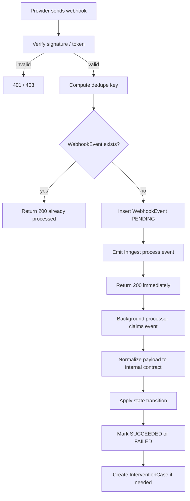

# Phase 8c Integration and Async Contract

Last updated: 2026-03-06
Owner: Phase 8 execution
Depends on:
- `docs/planning/phase-8/a/architecture.md`
- `docs/planning/phase-8/b/schema.md`

## 1. Legacy Workflow Mapping

| Legacy workflow | New contract |
|---|---|
| `[AC] (1) Instagram Following [PROD]` | `DiscoverySeed` + `CreatorSearchJob` + browser worker + approval queue |
| `[AC] (2) Follow Up Seeding [PROD]` | Gmail send pipeline + `BackgroundJob` / Inngest follow-up scheduler |
| `[AC] (3) (4) Answer Email & Get Address & Shopify [PROD]` | Gmail ingest + AI artifact pipeline + `ShippingAddressSnapshot` + `ShopifyOrder` |
| `[AC] (7) (8) (9) Mentions [TESTING]` | Shopify fulfillment sync + reminder scheduling + Instagram/webhook-or-poll mention ingest + `MentionAsset` |
| `[AC] Costs COGS + Tools - Seeding Orders` | `CostRecord` sync job attached to `ShopifyOrder` |
| `[AC] Message System [Draft]` | absorbed into platform inbox + AI draft pipeline; the Unipile-specific draft flow is not carried forward to v1 |

## 2. Integration Principles

1. Ingest fast, normalize, return immediately.
2. Heavy work always happens off the request path.
3. Every mutable step has a dedupe key.
4. Every provider failure lands in an operator-visible state.
5. Provider auth state is brand-scoped and revocable.
6. Browser automation is isolated from the public web app.
7. Legacy provider choice is not sacred; behavior parity is.

## 3. Public Integration Surface

| Surface | Route | Purpose | Auth / verification | Enqueues |
|---|---|---|---|---|
| Stripe webhook | `apps/web/app/api/webhooks/stripe/route.ts` | billing lifecycle sync | `stripe-signature` verification | `billing/subscription.sync` |
| Shopify callback | `apps/web/app/api/auth/shopify/callback/route.ts` | store OAuth install | OAuth state + HMAC | none inline beyond connection write |
| Shopify webhook | `apps/web/app/api/webhooks/shopify/route.ts` | orders/fulfillment/delivery updates | Shopify HMAC | `shopify/webhook.process` |
| Gmail callback | `apps/web/app/api/auth/gmail/callback/route.ts` | mailbox OAuth connect | OAuth state validation | mailbox watch registration follow-up |
| Gmail webhook/push | `apps/web/app/api/webhooks/gmail/route.ts` | mailbox notification ingress | Google verification token + brand resolution | `gmail/webhook.process` |
| Instagram webhook | `apps/web/app/api/webhooks/instagram/route.ts` | mention/event ingress | verify token + app secret signature | `instagram/webhook.process` |
| Inngest route | `apps/web/app/api/inngest/route.ts` | async function serving | Inngest signing | n/a |
| Internal creator-search callback | `apps/web/app/api/internal/creator-search/route.ts` | worker result ingest | internal HMAC/token | `creator-search/results.process` |
| Cron dispatch endpoints | `apps/web/app/api/cron/[job]/route.ts` | deterministic dispatch windows only | `CRON_SECRET` | specific `cron/*.requested` events |

## 4. Async Model: Inngest + Durable DB Rows

### Control Plane
- Inngest is the orchestration layer.
- Durable tables in Postgres provide:
  - operator visibility,
  - stale-lock recovery,
  - dedupe/claim state,
  - auditable retry history.

### Contract
1. A route handler or server action writes canonical state.
2. If background work is needed, it creates or updates:
   - a `WebhookEvent` row for provider ingress, or
   - a `BackgroundJob` row for scheduled/action work.
3. It emits an Inngest event with a stable id / dispatch key.
4. The Inngest function claims work from DB and executes it within a bounded time budget.
5. Completion writes back:
   - job/event status,
   - linked entity changes,
   - `ActivityLog` record,
   - `InterventionCase` if retries are exhausted or policy says manual review is required.

### Why both Inngest and DB rows
- Inngest gives retries, concurrency control, and deterministic scheduled execution.
- DB rows give operator-grade visibility and replay safety independent of Inngest internals.

## 5. Dispatch Windows and Cron Contract

Cron routes must never execute business logic directly. They only create deterministic dispatch requests.

### Pattern
- `GET /api/cron/followups`
- validate `CRON_SECRET`
- compute dispatch window for the current minute or job slot
- emit Inngest event with:
  - `source`
  - `requestedAt`
  - `dispatchKey`
  - `correlationId`
  - `dispatchWindowStart`
  - `dispatchWindowSeconds`

### Required cron families
- `cron/followups.requested`
- `cron/reminders.requested`
- `cron/gmail-poll.requested`
- `cron/instagram-poll.requested`
- `cron/alias-warmup.requested`
- `cron/health-check.requested`
- `cron/background-jobs.requested`

### Dispatch-key rule
`dispatchKey = {jobFamily}:{brandScopeOrGlobal}:{windowStartIso}`

The same dispatch key must be safe to re-send.

## 6. Webhook Normalization Contract



### Normalized WebhookEvent fields
- `provider`
- `eventType`
- `dedupeKey`
- `payloadHash`
- `brandId` if resolved
- `campaignCreatorId` if resolved
- `status`
- `attempts`
- `runAt`
- `lockedAt`
- `lockedBy`
- `startedAt`
- `finishedAt`
- `lastError`
- `raw`

### Signature Verification Rules
- Stripe: official SDK verification against raw body
- Shopify: HMAC against raw body
- Gmail push: verify Google header/token, then fetch actual message metadata via API before state mutation
- Instagram/Meta: GET verify-token handshake + signed body validation where supported
- Internal worker callback: HMAC or bearer token plus timestamp window

## 7. Background Job Catalog

| Job family | Trigger | Durable row | Inngest event | Dedupe key | Success effect |
|---|---|---|---|---|---|
| initial outreach | approval action | `BackgroundJob` | `campaign-creator/outreach.requested` | `outreach:initial:{campaignCreatorId}` | send welcome email once, move to `OUTREACHED` |
| follow-up | cron sweep | `BackgroundJob` | `campaign-creator/followup.requested` | `outreach:followup:{campaignCreatorId}:{followUpCount+1}` | increment follow-up counters and next follow-up date |
| reply process | Gmail webhook/poll | `BackgroundJob` | `message/reply-process.requested` | `reply:process:{messageId}` | classify reply, extract address, draft next action |
| address confirm | successful AI/manual capture | `BackgroundJob` | `campaign-creator/address-confirmed.requested` | `address:confirm:{campaignCreatorId}:{snapshotId}` | lock active address, move to `READY_FOR_ORDER` |
| order create | address locked | `BackgroundJob` | `shopify/order-create.requested` | `shopify:order:{campaignCreatorId}` | create one order and write external refs |
| fulfillment sync | Shopify webhook | `WebhookEvent` + `BackgroundJob` | `shopify/fulfillment-sync.requested` | `shopify:fulfillment:{externalOrderId}:{eventType}:{eventId}` | update order/creator delivery state |
| reminder schedule | delivery update | `BackgroundJob` | `campaign-creator/reminder-schedule.requested` | `reminder:schedule:{campaignCreatorId}:{type}` | create reminder row once |
| reminder send | cron sweep | `BackgroundJob` | `campaign-creator/reminder-send.requested` | `reminder:send:{reminderId}` | send message and stamp reminder |
| mention ingest | Instagram webhook/poll | `WebhookEvent` + `BackgroundJob` | `mentions/process.requested` | `mention:{platform}:{mediaUrl}` | create/update `MentionAsset` and counts |
| creator search dispatch | operator action | `BackgroundJob` + `CreatorSearchJob` | `creator-search/dispatch.requested` | `creator-search:dispatch:{searchJobId}` | hand off to worker |
| creator search result process | worker callback | `BackgroundJob` | `creator-search/results-process.requested` | `creator-search:results:{searchJobId}:{resultBatchHash}` | normalize/store candidates |
| billing sync | Stripe webhook | `WebhookEvent` + `BackgroundJob` | `billing/subscription-sync.requested` | `stripe:subscription:{stripeSubscriptionId}:{eventType}` | update subscription status |
| cost sync | cron or order update | `BackgroundJob` | `orders/cost-sync.requested` | `cost-sync:{shopifyOrderId}:{window}` | write `CostRecord` rows |
| alias warmup | daily cron | `BackgroundJob` | `email-alias/warmup.requested` | `alias-warmup:{emailAliasId}:{date}` | adjust send caps |
| health check | daily cron | `BackgroundJob` | `ops/health-check.requested` | `health-check:{date}` | write KPI summary / alerts |

## 8. Retry, Locking, and Poison-Job Rules

### Standard Retry Profile
- default max attempts: `3`
- default backoff: exponential with jitter
  - 1 minute
  - 5 minutes
  - 25 minutes

### Extended Retry Profile
Use max attempts `8` for provider webhooks that may arrive in bursts or against temporarily degraded providers.

### Locking
- row claimed by setting `lockedAt`, `lockedBy`, `status = RUNNING`
- stale lock threshold:
  - webhook/event queues: 5 minutes
  - browser-search jobs: 10 minutes
  - order/create and inbox jobs: 3 minutes

### Poison-job policy
- after max attempts, set status `FAILED`
- open `InterventionCase`
- preserve last raw error and linked entity IDs
- never silently drop failed work

## 9. Browser Worker Contract: Meta Creator Marketplace

### Ownership Boundary
- the worker is a separate service
- the app owns job creation, quotas, auth, and normalized persistence
- the worker owns browser contexts, session health, page navigation, result extraction, and evidence capture

### Request Contract

```json
{
  "searchJobId": "uuid",
  "brandId": "uuid",
  "campaignId": "uuid-or-null",
  "criteria": {
    "niche": ["beauty", "wellness"],
    "location": ["US", "CA"],
    "audienceSize": {"min": 5000, "max": 250000},
    "seedCreators": ["@creator1", "@creator2"],
    "excludeHandles": ["@existing1"]
  },
  "limits": {
    "maxResults": 100,
    "maxPages": 10
  }
}
```

### Callback Contract

```json
{
  "searchJobId": "uuid",
  "batchNumber": 1,
  "results": [
    {
      "platform": "INSTAGRAM",
      "handle": "creator_handle",
      "displayName": "Creator Name",
      "profileUrl": "https://...",
      "followerCount": 25000,
      "averageViews": 14000,
      "bioSnippet": "...",
      "fitScore": 82,
      "fitReasoning": "Matches seed niche and audience size",
      "raw": {}
    }
  ],
  "evidence": [
    {
      "handle": "creator_handle",
      "screenshotUrl": "s3://... or internal storage ref"
    }
  ],
  "complete": false,
  "error": null
}
```

### Worker Security
- signed request with shared secret or HMAC
- timestamp header to prevent replay
- reject callbacks older than 5 minutes unless explicitly marked replay

### Session Rules
- one browser context per job
- maximum runtime per job: 5 minutes by default
- no persistent logged-in browser per brand in the public app
- persistent marketplace session material, if needed, is encrypted in `ProviderCredential`

### Anti-detection / Failure Rules
- random humanized delays between actions
- bounded page count and result count
- if CAPTCHA or checkpoint appears:
  - stop extraction
  - mark `CreatorSearchJob` failed
  - create `InterventionCase`
  - preserve screenshot evidence
- if worker crashes once, retry the dispatch once with a fresh context
- after repeated failures, pause search for that brand and require operator review

### Fallbacks
- manual creator add form
- CSV import
- onboarding seed creators without live search

## 10. Gmail Contract

### Connection Modes
- preferred: Gmail push notifications + API fetch
- fallback: cron-based thread polling by alias

### Send Contract
- choose alias from active aliases for the brand
- reject send if alias is paused, disabled, or over current limit
- write outbound `Message` first or atomically with provider success metadata
- only stamp `firstOutreachAt` / `lastFollowUpAt` after confirmed provider success

### Reply Contract
- Gmail ingress never mutates `CampaignCreator` directly from the webhook
- it resolves thread + alias + brand, writes/updates `Message`, then enqueues reply processing

### Deliverability Policy
- platform cap per alias stays below hard Gmail threshold
- alias auto-pause if bounce/complaint policy is breached
- alias warm-up is a scheduled function, not a manual spreadsheet rule

### Production Readiness Caveat
- Google OAuth verification may take 2-6 weeks
- launch planning must support:
  - dev/test accounts during build
  - a poll fallback if push/watch registration is delayed
  - operator visibility when a mailbox loses auth

## 11. Shopify Contract

### Connect
- use Shopify custom app OAuth
- connection row stored in `BrandConnection`
- credentials stored in `ProviderCredential`

### Order Create
- allowed only when:
  - `CampaignCreator.lifecycleStatus = READY_FOR_ORDER`
  - a locked address snapshot exists
  - a brand product mapping exists
  - no existing `ShopifyOrder` exists for that `CampaignCreator`

### Fulfillment / Delivery
- raw webhook/event becomes `WebhookEvent`
- processor resolves to `ShopifyOrder`
- `FulfillmentEvent` rows are append-only
- `ShopifyOrder.status` and `CampaignCreator.deliveredAt` update idempotently
- reminder scheduling is triggered after delivery confirmation, not before

### Failure policy
- `422` validation failures open intervention immediately
- rate limit and transient failures retry
- never create a second order on replay

## 12. Instagram / Mentions Contract

### Ingest modes
- webhook when available
- poll fallback when webhook/business verification is unavailable

### Processing
- resolve brand + creator
- dedupe by `platform + mediaUrl`
- create `MentionAsset`
- increment `postCount` or `historyCount`
- suppress open reminder schedules when posting evidence exists

### Media Storage
- storage provider is not locked in this phase
- if asset storage/upload fails:
  - still create the mention record
  - store `storageError`
  - raise alert / intervention if operator action is needed

## 13. OpenAI Contract

### Allowed AI use
- reply intent classification
- address extraction
- next-best-action suggestion
- draft response generation
- creator fit explanation

### Guardrails
- structured output only
- send the minimum context needed
- do not include unrelated PII or full historical exports
- invalid JSON or low-confidence results never auto-advance lifecycle state

### Failure policy
- retry transient 429/5xx failures
- parse failure or low-confidence extraction creates intervention or falls back to human review

## 14. Idempotency Matrix for High-Risk Steps

| Lifecycle step | Dedupe key | Guard condition | On duplicate | On failure |
|---|---|---|---|---|
| approve creator | `review:approve:{campaignCreatorId}` | `reviewStatus = PENDING` | no-op | operator retry |
| decline creator | `review:decline:{campaignCreatorId}` | `reviewStatus = PENDING` | no-op | operator retry |
| initial outreach | `outreach:initial:{campaignCreatorId}` | approved, email present, not already outreached | skip | intervention after retries |
| follow-up N | `outreach:followup:{campaignCreatorId}:{n}` | no reply, threshold not exceeded | skip | intervention after retries |
| inbound message ingest | `message:{providerMessageId}` or hashed raw key | message not already stored | return 200 | webhook retry/queue retry |
| address snapshot create | `address:{campaignCreatorId}:{messageId}` | no locked snapshot for same normalized hash | skip | human review if ambiguous |
| lock address | `address-lock:{campaignCreatorId}:{snapshotId}` | snapshot confirmed, no order exists | skip | intervention |
| order create | `order:{campaignCreatorId}` | no order exists | skip | intervention |
| fulfillment event | `fulfillment:{externalOrderId}:{eventType}:{eventIdOrHash}` | order resolved | skip | queue retry |
| delivery mark | `delivery:{shopifyOrderId}:{eventIdOrHash}` | not already delivered at same timestamp | skip | queue retry |
| reminder schedule | `reminder-schedule:{campaignCreatorId}:{type}` | delivery exists, no open reminder of same type | skip | queue retry |
| reminder send | `reminder-send:{reminderId}` | reminder still due and unsuppressed | skip | retry then intervention |
| mention create | `mention:{platform}:{mediaUrl}` | no existing mention row | skip | queue retry |
| intervention open | `intervention:{campaignCreatorId}:{type}:{contextHash}` | open case not already present for same context | update existing | create/merge case |

## 15. Provider Stop Conditions and Escalation

| Provider | Stop condition | Immediate action | Escalation |
|---|---|---|---|
| Gmail | alias auth expired | pause alias, stop sends from alias | intervention on brand settings |
| Gmail | bounce rate above threshold | auto-pause alias | deliverability intervention |
| Gmail | complaint rate above threshold | auto-pause alias | deliverability intervention |
| Shopify | 422 address/product error | stop retries | intervention on order |
| Shopify | repeated 5xx / timeout | bounded retries | intervention after max attempts |
| Meta worker | CAPTCHA / checkpoint | stop session, preserve evidence | search intervention |
| Meta worker | repeated crash / timeout | retry once with fresh context | pause brand search access |
| Instagram | malformed payload | log, no retry | operator review if pattern repeats |
| OpenAI | low-confidence or invalid parse | no auto-advance | human inbox / intervention |
| Stripe | signature mismatch | reject | security log |

## 16. Operational Observability Contract

### Every failed provider/job path must emit
- brand id
- campaign id if present
- campaign creator id if present
- provider
- stage
- dedupe key
- external id / event id if present
- last error
- retry count

### Daily health summary
- creators waiting approval
- approved without email
- awaiting reply
- awaiting address
- ready for order
- order creation failures
- delivered but not posted
- open interventions
- paused aliases
- failed background jobs
- failed webhook events

### Required alert channels
- product/ops owned Slack or equivalent
- in-app intervention queue

## 17. Production Readiness Gates

- Gmail OAuth verification plan exists and is in flight
- Shopify custom app scopes are documented and tested
- Instagram webhook access is validated or poll fallback is enabled
- creator-search worker has explicit quota caps and failure evidence capture
- every lifecycle mutation listed in the parity checklist has a dedupe key
- queue runners and webhook handlers have replay-safe behavior
